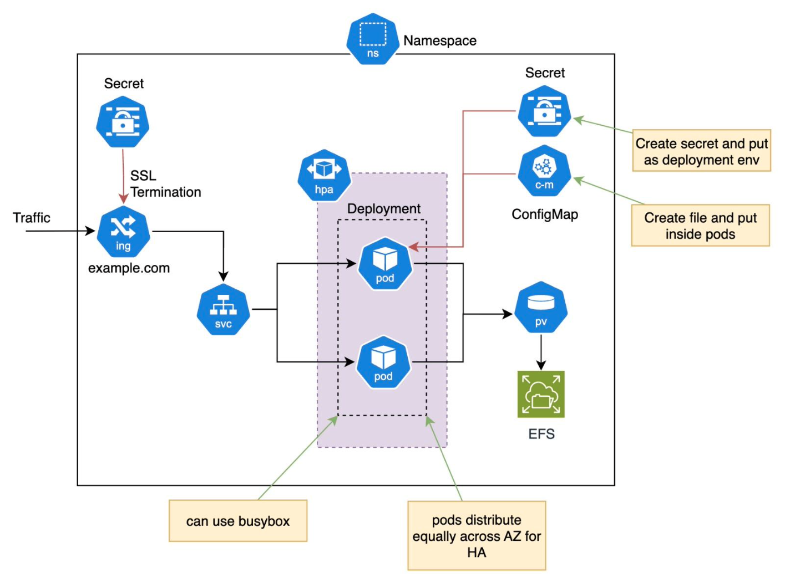

# Assignment

## Question 1
Create Infra as a Code (IaC) based on architecture diagram above. You can use Terraform or Cloudformation. 

Review solution [here](https://github.com/dahrihadri/assignment/tree/main/question-1-cloudformation)

## Question 2
Create a Kubernetes manifest based on the architecture diagram above.

Review solution [here](https://github.com/dahrihadri/assignment/tree/main/question-2-kubernetes)
