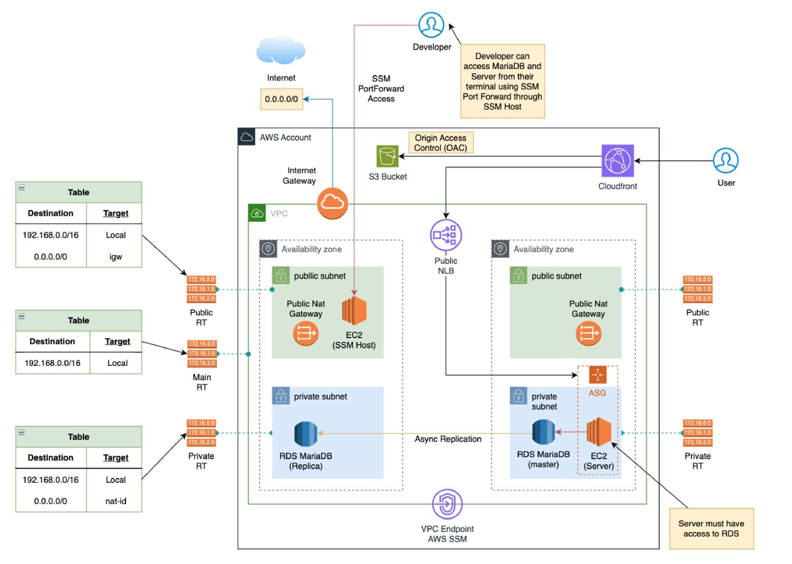

# AWS Infrastructure Project Using CloudFormation

This project contains AWS CloudFormation templates for deploying an AWS infrastructure setup, including VPC, EC2 instances, RDS, Network Load Balancer (NLB), and S3 services. The infrastructure is modularized into several CloudFormation stack templates for better organization and reusability.


```graphql
/question-1-cloudformation
├── cloudfront-plus-s3-stack.yml
├── cloudfront-stack.yml
├── ec2-stack.yml
├── networking-stack.yml
├── nlb-stack.yml
├── rds-stack.yml
├── s3-stack.yml
├── ssmhost.yml
├── template.yml
├── vpc-endpoints.yml
└── vpc-stack.yml
```


## CloudFormation Stacks

### 1. VPC Stack (`vpc-stack.yml`)
This stack sets up a Virtual Private Cloud (VPC) with public and private subnets, an Internet Gateway, and NAT Gateways. It outputs references to created resources for use in other stacks.

### 2. RDS Stack (`rds-stack.yml`)
This stack provisions a MariaDB RDS instance within the defined private subnets. It includes settings for backups, maintenance windows, and security group configuration.

### 3. NLB Stack (`nlb-stack.yml`)
This stack creates a Network Load Balancer (NLB) to distribute incoming traffic across multiple targets. It defines a target group and listener configuration.

### 4. S3 Stack (`s3-stack.yml`)
This stack creates an S3 bucket to store data. The bucket name is defined in the properties.

### 5. SSM Host Stack (`ssmhost.yml`)
This stack provisions an EC2 instance with SSM Agent and necessary IAM roles for management and access. The instance runs in a public subnet.

### 6. VPC Endpoints Stack (`vpc-endpoints.yml`)
This stack sets up interface VPC endpoints for AWS services (SSM, EC2, etc.) and a gateway endpoint for S3, ensuring private connectivity to AWS services from private subnets.

### 7. Template Stack (`template.yml`)
This is the main entry point that orchestrates all other stacks, providing parameters and invoking the nested stacks.

## Usage

1. **Prerequisites**: Ensure you have the AWS CLI and Terraform installed and configured with the appropriate permissions.

2. **Deploying the Infrastructure**:
   - Navigate to the `terraform-project` directory.
   - Use the AWS CloudFormation service to create the stacks defined in the `template.yml`.

3. **Stack Creation Order**:
   - VPC Stack
   - S3 Stack (for bucket creation)
   - SSM Host Stack
   - NLB Stack
   - RDS Stack
   - VPC Endpoints Stack

4. **Outputs**: After stack creation, you can access the outputs defined in each stack for resources like VPC ID, subnet IDs, security group IDs, and more.

## Notes
- Modify any parameters in the YAML files as necessary to fit your specific use case.
- Ensure proper IAM roles and policies are in place for any services requiring access.

## License
This project is licensed under the MIT License - see the [LICENSE](LICENSE) file for details.

