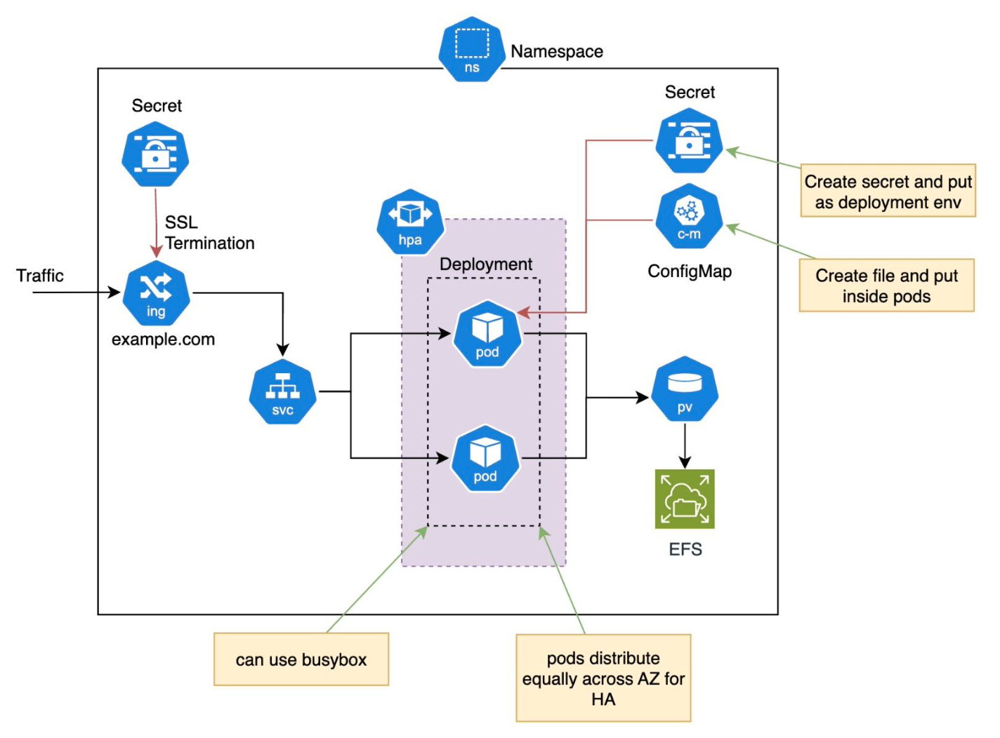

# Question 2 Kubernetes Helm Chart
Create a Kubernetes manifest based on the architecture diagram above.


This repository contains a Helm chart to deploy an above example application using Amazon EFS (Elastic File System) as persistent storage in a Kubernetes cluster. The chart includes configurations for Persistent Volumes (PV), Persistent Volume Claims (PVC), Ingress, and deployment resources. Follow the steps below to deploy and test this Helm chart.

## Table of Contents

- [Prerequisites](#prerequisites)
- [Setup](#setup)
- [Deploy the Helm Chart](#deploy-the-helm-chart)
- [Access the Application](#access-the-application)
- [Troubleshooting](#troubleshooting)
- [Helm Chart Structure](#helm-chart-structure)

## Prerequisites

Before using this Helm chart, ensure you have the following:

- A Kubernetes cluster up and running (e.g., Minikube, EKS, etc.)
- [Helm 3](https://helm.sh/docs/intro/install/) installed
- `kubectl` CLI installed and configured to connect to your Kubernetes cluster
- AWS EFS CSI driver installed on your Kubernetes cluster
- A pre-configured EFS file system available (for example: `fs-12345678`)

## Setup

1. **Clone this Repository:**

   ```bash
   git clone https://github.com/dahrihadri/assignment.git
   cd question-2-kubernetes
   ```

2. **Update values.yaml File:**

```yaml
namespace: example-namespace       # Change to your desired namespace
replicas: 3                        # Number of replicas for the deployment
ingress:
  host: example.com                # Change to your desired ingress host
storage:
  size: 10Gi                       # Storage size for the EFS volume
efs:
  volumeHandle: fs-12345678        # Replace with your EFS file system ID

```

3. **Create the Kubernetes Namespace:**

```yaml
kubectl create namespace example-namespace
```

## Deploy the Helm Chart

1. **Install the Helm Chart:**
Run the following command to deploy the chart:

```bash
helm install example-app . --values values.yaml --namespace example-namespace
```

2. **Upgrade the Helm Chart (if any changes are made):**

If you update the values.yaml file or make any other changes, use the following command to upgrade:

```bash
helm upgrade example-app . --values values.yaml --namespace example-namespace
```

3. **Uninstall the Helm Chart:**

If you want to delete the release, use:

```bash
helm uninstall example-app --namespace example-namespace
```

## Access the Application

1. **Verify the Deployment:**

Check if the pods are running:

```bash
kubectl get pods -n example-namespace
```

2. **Check the Ingress:**

If you configured an Ingress, you can access the application via the specified host (e.g., example.com). Ensure your DNS settings point to the Ingress controller's IP or update your /etc/hosts file to include the host mapping.

## Troubleshooting

1. **PersistentVolume and PersistentVolumeClaim Issues:**

Ensure the EFS CSI driver is correctly installed, and the EFS file system ID is valid. Check the logs of the EFS CSI driver for more information.

```bash
kubectl logs -l app=efs-csi-controller -n kube-system
```

2. Pod Errors or CrashLoopBackOff:

Describe the pod to check for errors:

```bash
kubectl describe pod <pod-name> -n example-namespace
```

3. **Helm Namespace Annotations Issue:**

If you see issues related to Helm tracking resources in the namespace, or if you see warnings about conflicting annotations, you can manually add the correct annotations to your namespace. This should not typically be required, but if needed, run the following commands:

```bash
kubectl annotate namespace example-namespace meta.helm.sh/release-name=question-2-kubernetes
kubectl annotate namespace example-namespace meta.helm.sh/release-namespace=example-namespace
```

After running the above commands, retry your helm install or helm upgrade command.

## Helm Chart Structure

The main files in this repository are:

```graphql
question-2-kubernetes/
├── Chart.yaml          # Helm chart metadata
├── values.yaml         # Configuration values
├── templates/
│   ├── pv-pvc.yaml     # PersistentVolume and PersistentVolumeClaim templates
│   ├── deployment.yaml # Deployment template
│   ├── ingress.yaml    # Ingress template
│   └── service.yaml    # Service template
└── README.md           # Project documentation
```
## License

This project is licensed under the MIT License. See the [License](#license) file for details.

## Contributing

Feel free to open issues or submit pull requests to improve the chart!


